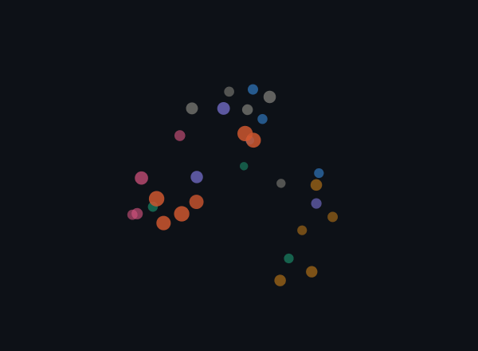

# Luke Moffat — AI Portfolio

A personal portfolio site with a retrieval-augmented "chat with AI Luke" assistant. Visitors can ask questions about my background, skills, and projects and get answers grounded in a real knowledge base instead of made-up ones. The assistant embeds each question, finds the most relevant facts with a vector search, and feeds them to a language model to write the reply.

Built with React, Vite, Vercel serverless functions, Google Gemini, and Supabase pgvector.

<div align="center">



*The knowledge base, visualized — every fact is stored as a 768-dimensional vector. Projected down to 3D, chunks about the same topic cluster together. This is the same proximity the chat's retrieval step relies on.*

</div>

## Overview

The site is a normal React single-page portfolio (hero, about, projects, contact) with an AI chat panel at the bottom. When a visitor asks a question, the request goes to a Vercel serverless function that runs a full RAG (retrieval-augmented generation) pipeline:

```
question ─► embed ─► vector search (pgvector) ─► top matches ─► prompt + Gemini ─► grounded answer
```

### Features

* **RAG chat** — answers are grounded in a markdown knowledge base, not hallucinated; if the answer isn't in the context, the bot says so and points to the contact form
* **Vector search** — chunks are stored as 768-dim embeddings in Supabase and retrieved by cosine similarity using a pgvector HNSW index
* **Markdown answers** — the chat renders the model's Markdown (lists, bold, links) instead of showing raw text
* **Rate limiting** — per-IP limits (8/min, 40/day) stored in Postgres keep the free tiers free
* **Resilient generation** — transient Gemini errors are retried and fall back to a lighter model under load
* **Embedding visualization** — a reproducible script renders the knowledge base as the rotating 3D GIF above

## Instructions for Build and Use

Steps to build and/or run the software:

1. Clone the repository
   ```bash
   git clone https://github.com/moffatluke/portfolio.git
   cd portfolio
   ```
2. Install the dependencies
   ```bash
   npm install
   ```
3. Create a `.env.local` file in the project root with your keys
   ```
   GEMINI_API_KEY=your_key_here
   SUPABASE_URL=your_project_url
   SUPABASE_SERVICE_ROLE_KEY=your_service_role_key
   RESEND_API_KEY=your_resend_key
   CONTACT_TO_EMAIL=you@example.com
   ```
4. Create the database tables — run `supabase/schema.sql` in the Supabase SQL editor
5. Embed the knowledge base, then start the dev server
   ```bash
   node --env-file=.env.local scripts/ingest.mjs
   npm run dev
   ```

Instructions for using the software:

1. Open the local URL Vite prints (e.g. **http://localhost:5173/**)
2. Scroll to the **Ask my AI** panel at the bottom of the page
3. Type a question about my background, skills, or projects — or click a suggested question
4. To change what the AI knows, edit the markdown files in `knowledge/` and re-run the ingest script

## Interesting Code

### Contextual chunk headers — making retrieval actually work

Each knowledge chunk is prefixed with its document title and section before it gets embedded. Without this, a chunk describing a single project never contains the word "project" or its own name, so it scores poorly against a question like "list his projects." The header injects that topical context into the vector.

```js
// scripts/lib/chunk.mjs — "<Doc Title> — <Section>" prefixed onto each chunk
const headerFor = (section) => {
  const parts = []
  if (docTitle) parts.push(docTitle)
  if (section && section !== 'intro' && section !== docTitle) parts.push(section)
  return parts.join(' — ')
}
```

### Vector search — finding the nearest chunks in SQL

Retrieval is a single Postgres function. The `<=>` operator is pgvector's cosine distance; ordering by it and limiting returns the most similar chunks.

```sql
-- supabase/schema.sql
create function match_documents (query_embedding vector(768), match_count int default 5)
returns table (id bigint, content text, metadata jsonb, similarity float)
language sql stable as $$
  select id, content, metadata, 1 - (embedding <=> query_embedding) as similarity
  from documents
  order by embedding <=> query_embedding
  limit match_count;
$$;
```

### Grounding the model — answer only from context

The system prompt stuffs the retrieved chunks in and instructs the model to stay inside them, which is what stops it from inventing facts.

```js
// api/_lib/prompt.js
- Answer using ONLY the context below. Do not invent facts.
- If the context does not contain the answer, say you don't have that detail
  and suggest using the "Send a message" button on the site.
```

## Development Environment

To recreate the development environment, you need the following software and/or libraries with the specified versions:

* Node.js v18+
* React 19 and Vite 7
* `@google/generative-ai` 0.24 — Gemini embeddings (`gemini-embedding-001`, 768-dim) and generation (`gemini-2.5-flash`)
* `@supabase/supabase-js` 2.x — Postgres + pgvector client
* Supabase project with the `vector` extension enabled
* `resend` 6.x — transactional email for the contact form
* `react-markdown` 10.x — renders the chat replies
* Vitest 4.x — unit tests
* A free [Google AI Studio](https://aistudio.google.com/) API key
* Editor: Visual Studio Code

## Useful Websites to Learn More

I found these websites useful in developing this software:

* [Google Gemini API docs](https://ai.google.dev/gemini-api/docs)
* [Supabase pgvector / AI & Vectors docs](https://supabase.com/docs/guides/ai)
* [pgvector (GitHub)](https://github.com/pgvector/pgvector)
* [Vercel Functions docs](https://vercel.com/docs/functions)
* [Vite Guide](https://vite.dev/guide/)
* [Resend docs](https://resend.com/docs)
* [What is Retrieval-Augmented Generation? (AWS)](https://aws.amazon.com/what-is/retrieval-augmented-generation/)

## Future Work

The following items I plan to fix, improve, and/or add to this project in the future:

* [ ] Deploy the site to a public host on Vercel
* [ ] Wire the contact form to the `/api/contact` function (Resend email + Supabase)
* [ ] Stream the chat responses with a typing effect instead of waiting for the full answer
* [ ] Add an interactive (rotatable) version of the embedding map as a page on the live site
* [ ] Remember the conversation across page reloads
* [ ] Expand the knowledge base and add hybrid keyword + vector search
