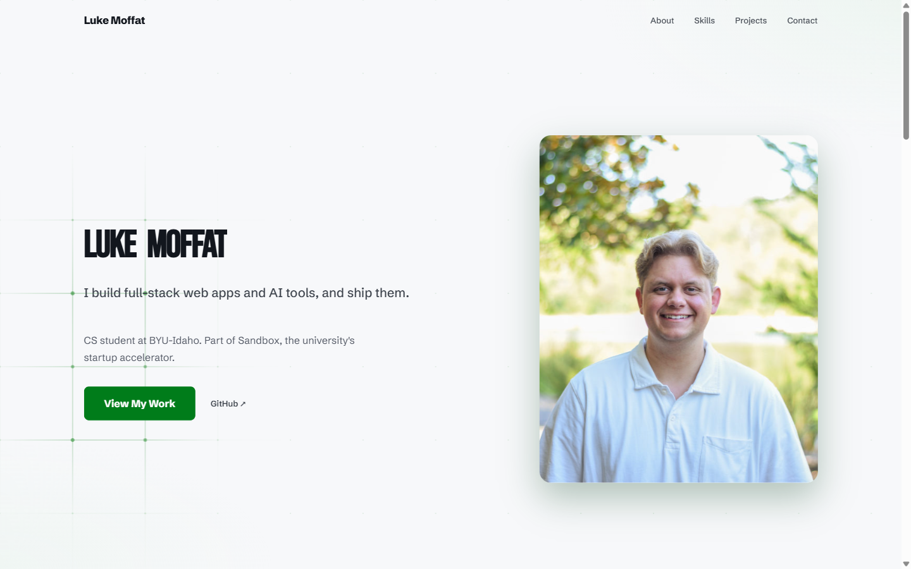
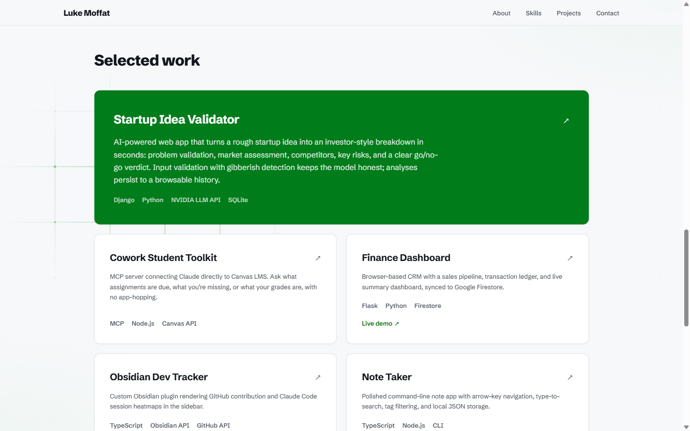
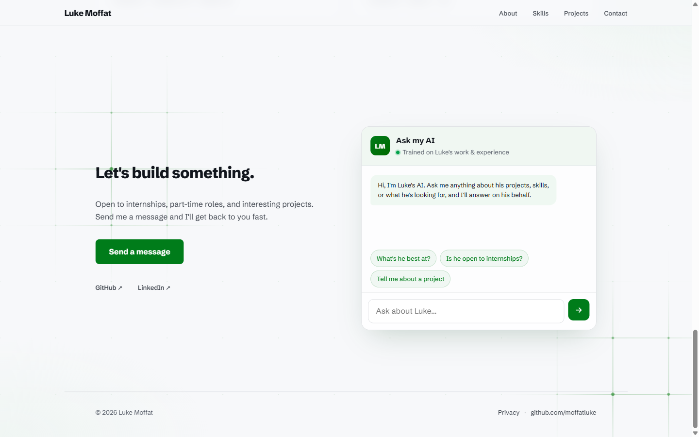

# Luke Moffat — AI Portfolio

**Live site → [moffatluke.com](https://moffatluke.com)**

A personal portfolio site with a "chat with AI Luke" assistant. Visitors ask questions about my background, skills, and projects and get answers grounded in a real knowledge base. The assistant embeds each question, finds the most relevant facts with a pgvector similarity search, and feeds them to a language model to write the reply — no hallucinated answers, no made-up facts.

Built with **React + Vite**, **Vercel serverless functions**, **Google Gemini** (embeddings + generation), and **Supabase pgvector**.

---

<div align="center">

| Hero | Projects |
|:---:|:---:|
|  |  |

| AI Chat panel |
|:---:|
|  |

</div>

---

## Overview

The site is a React single-page portfolio (hero, about, skills, projects, contact) with an AI chat panel wired to a full **RAG** (retrieval-augmented generation) pipeline:

```
question ─► embed (Gemini) ─► cosine search (pgvector) ─► top chunks ─► prompt + Gemini ─► grounded answer
```

The rotating GIF below shows the knowledge base itself — every fact stored as a 768-dimensional vector, projected to 3D. Chunks about the same topic cluster together, and that proximity is exactly what drives retrieval.

<div align="center">


</div>

### Features

* **RAG chat** — answers grounded in a markdown knowledge base; if the answer isn't in context, the bot says so and directs users to the contact form
* **Vector search** — chunks stored as 768-dim embeddings in Supabase, retrieved by cosine similarity via a pgvector HNSW index
* **Markdown answers** — replies render lists, bold text, and links instead of raw strings
* **Scoped rate limiting** — per-IP limits (8/min, 40/day) stored in Postgres; chat and contact endpoints use disjoint hash keyspaces so they can't interfere
* **Resilient generation** — transient Gemini errors are retried and fall back to a lighter model under load
* **Contact form** — validated, stored in Supabase, and delivered by Resend; client-side and server-side validation both run
* **Security** — IP hashed with HMAC-SHA256 (never stored raw), security headers on every route, secrets kept server-side only
* **Privacy-friendly analytics** — Vercel Web Analytics + Speed Insights (cookieless, no consent banner needed)
* **Embedding visualization** — a reproducible script renders the knowledge base as a rotating 3D GIF

---

## Instructions for Build and Use

Steps to build and/or run the software:

1. Clone the repository
   ```bash
   git clone https://github.com/moffatluke/portfolio.git
   cd portfolio
   ```
2. Install dependencies
   ```bash
   npm install
   ```
3. Create `.env.local` in the project root
   ```
   GEMINI_API_KEY=your_key_here
   SUPABASE_URL=your_project_url
   SUPABASE_SERVICE_ROLE_KEY=your_service_role_key
   RESEND_API_KEY=your_resend_key
   CONTACT_TO_EMAIL=you@example.com
   ```
4. Apply the database schema — run `supabase/schema.sql` in the Supabase SQL editor
5. Embed the knowledge base, then start the dev server
   ```bash
   node --env-file=.env.local scripts/ingest.mjs
   npm run dev
   ```

Instructions for using the software:

1. Open the local URL Vite prints (e.g. `http://localhost:5173/`)
2. Scroll to the **Ask my AI** panel at the bottom of the page
3. Type a question about my background, skills, or projects — or tap a suggested question
4. To change what the AI knows, edit the markdown files in `knowledge/` and re-run the ingest script
5. The contact form (Send a message button) is fully wired — submissions are stored in Supabase and emailed via Resend

---

## Interesting Code

### Contextual chunk headers — making retrieval actually work

Each knowledge chunk is prefixed with its document title and section before embedding. Without this, a chunk describing a project never contains the word "project" or its own name, so it scores poorly against "list his projects." The header injects topical context directly into the vector.

```js
// scripts/lib/chunk.mjs
const headerFor = (section) => {
  const parts = []
  if (docTitle) parts.push(docTitle)
  if (section && section !== 'intro' && section !== docTitle) parts.push(section)
  return parts.join(' — ')
}
// stored as: "Projects — Startup Idea Validator\n\nBuilt a Django…"
```

### Scoped rate limiting — preventing keyspace collisions between endpoints

Chat and contact each call `checkAndRecord`, but they need separate rate-limit buckets. Rather than adding a column to the database, the endpoint scope is folded into the HMAC hash itself — so the same IP produces a completely different hash per endpoint. No schema change, no extra query.

```js
// api/_lib/rateLimit.js
export function hashIp(ip, scope = 'global') {
  const pepper = process.env.SUPABASE_SERVICE_ROLE_KEY || 'local-dev-pepper'
  return createHmac('sha256', pepper).update(`${scope}:${String(ip)}`).digest('hex')
}
// chat endpoint:    hashIp(ip, 'chat')    → 3f8a…
// contact endpoint: hashIp(ip, 'contact') → b91c…  (disjoint keyspace)
```

### Vector search — finding the nearest chunks in SQL

Retrieval is a single Postgres function. The `<=>` operator is pgvector's cosine distance; ordering by it and limiting to 5 returns the most semantically similar chunks to the visitor's question.

```sql
-- supabase/schema.sql
create function match_documents (query_embedding vector(768), match_count int default 5)
returns table (id bigint, content text, metadata jsonb, similarity float)
language sql stable as $$
  select id, content, metadata, 1 - (embedding <=> query_embedding) as similarity
  from documents
  order by embedding <=> query_embedding
  limit match_count;
$$;
```

### Grounding the model — answers only from retrieved context

The system prompt stuffs the retrieved chunks in and explicitly prohibits inventing facts. This is the core of RAG: the retrieval step finds what's relevant, and the generation step is constrained to stay inside it.

```js
// api/_lib/prompt.js
- Answer using ONLY the context below. Do not invent facts.
- If the context does not contain the answer, say you don't have that detail
  and suggest using the "Send a message" button on the site.
```

---

## Development Environment

To recreate the development environment, you need the following software and/or libraries with the specified versions:

* Node.js v18+
* React 19 and Vite 7
* `@google/generative-ai` 0.24 — embeddings (`gemini-embedding-001`, 768-dim) + generation (`gemini-2.5-flash`)
* `@supabase/supabase-js` 2.x — Postgres + pgvector client
* Supabase project with the `vector` extension enabled (free tier works)
* `resend` 6.x — transactional email for the contact form
* `react-markdown` 10.x — renders chat replies
* `@vercel/analytics` + `@vercel/speed-insights` — privacy-friendly analytics
* Vitest 4.x — unit tests
* A free [Google AI Studio](https://aistudio.google.com/) API key (create a fresh project for the free quota)
* Vercel CLI — `npm i -g vercel` — for local serverless function dev and deployment
* Editor: Visual Studio Code

---

## Useful Websites to Learn More

I found these websites useful in developing this software:

* [Google Gemini API docs](https://ai.google.dev/gemini-api/docs)
* [Supabase pgvector / AI & Vectors docs](https://supabase.com/docs/guides/ai)
* [pgvector (GitHub)](https://github.com/pgvector/pgvector)
* [What is Retrieval-Augmented Generation? (AWS)](https://aws.amazon.com/what-is/retrieval-augmented-generation/)
* [Vercel Functions docs](https://vercel.com/docs/functions)
* [Vite Guide](https://vite.dev/guide/)
* [Resend docs](https://resend.com/docs)

---

## Future Work

The following items I plan to fix, improve, and/or add to this project in the future:

* [x] Deploy the site to a public host on Vercel — live at [moffatluke.com](https://moffatluke.com)
* [x] Wire the contact form to the `/api/contact` function (Resend email + Supabase storage)
* [ ] Stream the chat responses with a typing effect instead of waiting for the full answer
* [ ] Add an interactive (rotatable) version of the embedding map as a live page section
* [ ] Remember the conversation across page reloads (localStorage + session context window)
* [ ] Expand the knowledge base and add hybrid keyword + vector search (BM25 + pgvector RRF)
